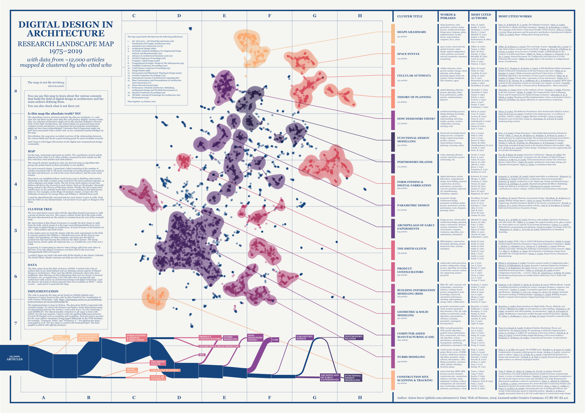

This is a map of **Digital Design in Architecture**. It is created with data from 12,000 articles published between 1975 and 2019.

You can download a [high-res PDF version here](images/map-digital-design-in-architecture.pdf).

You can use this map to learn about the various concepts that build the field of **Digital Design in Architecture** and the main authors defining them.

You can also check what is NOT there yet.

Eager to look at the code? [Here it is](research-map-digital-design.ipynb).

# Is this map the absolute truth? NO! 

***The map is not the territory.*** Alfred Korzybski

The algorithms used to structure and plot the data are stochastic, i.e. each time you run them on the same data they will produce slightly varying results. Also, my selection of literature might not be the absolute definitive research body in this field. Furthermore, the cluster labels are generated from most common words and phrases, so important but less popular contributions might not have been acknowledged. Literature that is important might not have been associated with a cluster and, so too, remained unacknowledged on the map.

Nevertheless, the map gives an initial overview of the relationships between the various fields and can be a good starting point for more in-depth research.

And I hope it will trigger discussions in the digital and computational design community.

In any case, I would love to hear from you. Email me at antonsavov@gmail.com or [open an issue on GitHub](https://github.com/antonsavov).

# DIGITAL DESIGN IN ARCHITECTURE
I use the term *Digital Design* as it is the broadest and most neutral of all terms that describe the relationship between architectural design and information technology. *Computational design*, *parametric design* and *algorithmic design* are other commonly used terms. They are however more specific and would not include things like *CAM* and *BIM*. 

[Here is a short video](https://youtu.be/sCptKvK-9Hg) that I recorded for my students at the [Digital Design Unit](https://www.dg.architektur.tu-darmstadt.de/fachgebiet_ddu/index.de.jsp) at the Technical University of Darmstadt that gives an overview of Computational Design in Architecture.

# MAP

On the map, each point represents an article. The coordinates of each article depend on how close it is to other articles, measured by how similar are the lists with their cited articles and cited authors.

The research clusters marked in color are derived using an algorithm that groups the points based on their proximity to one another.

For each research cluster, I generated a label consisting of the number of articles associated with it, the most commonly occurring phrases and words in the titles and abstracts, as well as the most cited authors, and the most cited articles.

Since there are established three-word-terms such as *Building Information Modeling* in the field, it makes sense to look for the most common trigrams, as well as bigrams and single words. The list of top-cited authors reveals who defines and drives the research in each cluster, such as Christopher Alexander being central to the *Theory of Planning* cluster. Finally, the list of most cited articles gives us the seminal works that everyone working in that field always refers to. For example, in the *Shape Grammars* cluster, we have the [*The Palladian Grammar*](https://journals.sagepub.com/doi/abs/10.1068/b050005) by George Stiny and William J. Mitchell from 1978. 

I used the algorithmically extracted info for each cluster to give it a title. Note that the titles are my interpretation. Let me know if you agree or disagree with them.

# CLUSTER TREE
The tree chart at the bottom of the map image traces when did the algorithm found it necessary to split a group of articles into two. The sooner a cluster broke off of the main trunk, the more disconnected are the articles it contains from the rest of the research body.

My observation is that *Shape Grammars* is usually the first cluster to split from the bulk, which means it is the topic most distinguishable from every other topic in digital design in architecture. At least in terms of the features we use — cited authors and cited works.

It also makes sense to track the cluster with the early experiments in the field. It contains authors like William J. Mitchell and covers all the diverse case studies and hypotheses of what computers can bring into the field of architecture that had become the seeds for the other clusters. The *Early Experiments* cluster splits off relatively late, i.e. it builds the core of the tree’s trunk.

In general, it is interesting to observe where things split from each other in this tree. If we take *Shape Grammars* out then what is the next most distinguishable field of research?

I couldn’t figure out what’s the deal with all the *Smiths* in the cluster I labeled *The Smith Glitch*. Maybe someone can help me solve this mystery.

# DATA
The data comes from the [Web-of-Science(WOS)](www.webofknowledge.com). I started with a list of authors that in my mind defined and are defining various aspects of *Digital Design in Architecture*. Then I got the full list of journals where they have published. After filtering out the publications that were too broad, or focused on history, art, or engineering, I was left with a list of 19 journals and conferences with a focus on architectural design and digital technology. I got the data for all articles in those journals that were available on WOS — about 12,000 — and used it to generate the map.

# IMPLEMENTATION
The code to generate the map can be found on [here](research-map-digital-design.ipynb) and is based on the code by Max Noichl for his [visualization of 20th Century Philosophy](https://homepage.univie.ac.at/noichlm94/posts/structure-of-recent-philosophy-iii/).

The implementation is done in Python. The data from WOS is imported with [metaknowledge](https://github.com/UWNETLAB/metaknowledge). To extract the features and build a multi-dimensional space of relationships between the articles I used `scikit-learn`. For the clustering, I used [HDBSCAN](https://github.com/scikit-learn-contrib/hdbscan). The dimensionality reduction to 2D space is done with [UMAP](https://github.com/lmcinnes/umap). 

For the text analysis, I had to unify the spelling differences between US and UK English such as *modeling* and *modelling*. And also had to account for the same author sometimes being logged differently in the WOS database, for example, "Gramazio, Fabio" and "Gramazio, F.".

For plotting the map I used `ggplot2` in `R`. The tree chart is created with [SankeyWidget](https://github.com/ricklupton/ipysankeywidget).
The final graphic is edited with Affinity Designer.

# HOW TO CITE

Anton Savov (2020). Digital Design in Architecture: Research Landscape Map 1975-2019, CC BY-NC-SA 4.0, www.github.com/antonsavov/research-maps

# CREDITS
Author: [Anton Savov](www.github.com/antonsavov)

Data: Web-of-Science, 2019

Map Image, Licensed under Creative Commons: CC BY-NC-SA 4.0

Code Licensed under MIT License

