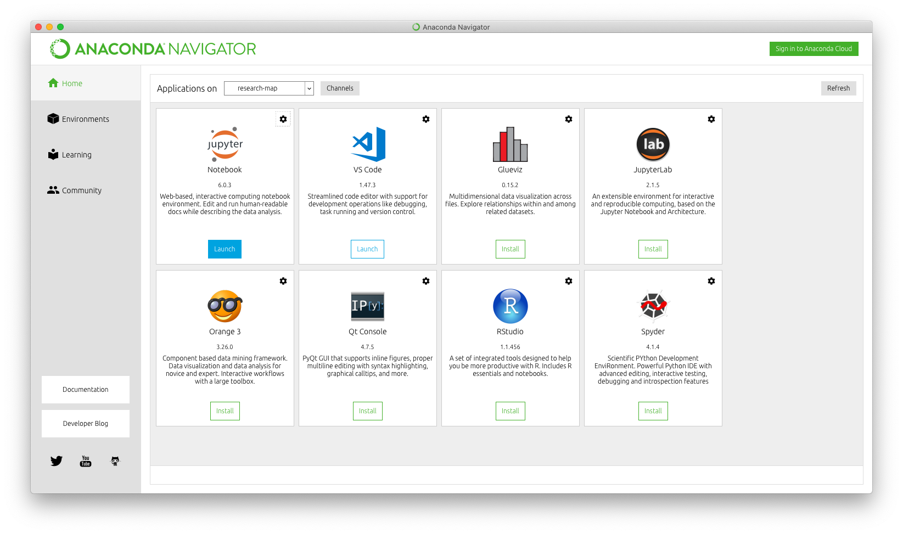

# Set up your developing environment

To run the scripts that process the data and generate the map of research landscape you will need `Python` and [R](https://rstudio.com) running in a [Jupyter Notebook](https://jupyter.org). Both Python and R are used in data science and offer various strengths. Jupyter Notebook lets you create mixed documents that have text cells so you can describe what you are doing at a certain step of the process and code cells running Python or R scripts. When a code cell is run it shows its output below the cell and that is useful when handling data science processes which require lots of going back and forth until you get the right parameters for a given step in the data processing pipeline.

Here is how to setup the development environment that you need.

## Setting up the environment on ***macOS***

### STEP 1 — Install XCode
Install XCode from the App Store and run it at least once to make sure all compiler tools are setup. If prompted let it install the required components.

----
### STEP 2 — Install Java
For some reason the development environment needs *Java*. Probably `R` needs it. Unfortunately, *Java* doesn't come with *macOS* anymore and needs to be installed separately. For *macOS Catalina*, get `Java JDK 13` and install it. You can [download it from here](https://www.oracle.com/technetwork/java/javase/downloads/jdk13-downloads-5672538.html).

### STEP 3 — Install the font Roboto Condensed
You can get it from Google Fonts. The font is needed for some built in themes that the chart plotting library uses.

----
### STEP 3 — Install Anaconda
I use [Anaconda](https://www.anaconda.com/distribution/) to manage environments.
Download and install Anaconda for Python 3.

---
### STEP 4 — Create the environment
Download or clone this git repo. Open Terminal and navigate to the repo folder on your system. Run the following to create the environment from the included YAML file. The environment will be named `research-map`:

    conda env create -f environment.yml

Or run the following to create the environment from scratch and give it your own name by changing `your_env_name`:

    conda create -n your_env_name -c conda-forge python=3.7.1 r-base=3.5.1 pandas=0.23.4 matplotlib=3.0.2 seaborn=0.9.0 rpy2=2.9.1 metaknowledge=3.3.2 umap-learn=0.3.7 hdbscan=0.8.18 r-ggplot2=3.0.0 r-hrbrthemes r-fields r-plyr r-gridextra r-ggrepel=0.8.0 r-ggalt r-ggforce r-stringr=1.3.1 simplegeneric=0.8.1 scikit-learn=0.20.2 scipy=1.2.0 numba=0.41.0 r-clue=0.3_57 ipysankeywidget

Wait for conda to solve the environment and figure out what needs to be installed and confirm with `y` and press `enter`.
It will take a few minutes to solve, download and install all packages.

Then activate the environment with:

    conda activate your_env_name

Then run the following to set the environment variables needed for R:

    conda env config vars set R_HOME=$CONDA_PREFIX/lib/R
    conda env config vars set R_USER=$CONDA_PREFIX/lib/python3.7/site-packages/rpy2
---
### STEP 5 — Open Jupyter notebook
Open the Anaconda Navigator go to `Home`. Make sure the environment we created above is selected in the drop down menu and then install and launch `Jupyter Notebook`.

Jupyter will open in your default Web Browser. Find and open the file `landscape-digital-design.ipynb`

---

That's it! The environment is set up. The next steps to producing the map are described in the [Jupyter notebook here](research-map-digital-design.ipynb).